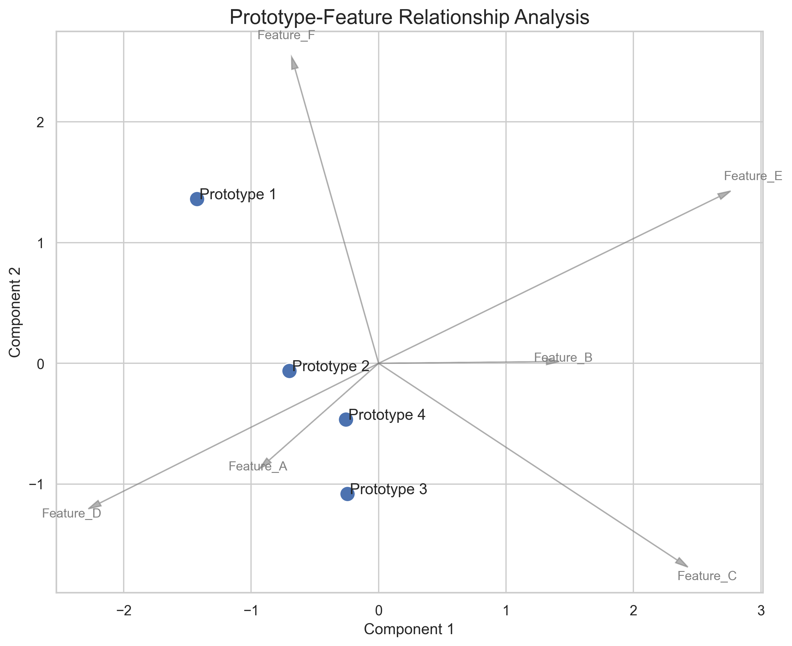

# verskyt.visualizations

Visualization tools for Tversky Neural Networks.

This module provides functions for visualizing and interpreting learned prototypes
and features in TNNs. The functions are designed to make abstract concepts of
"prototypes" and "features" tangible and visible for research analysis.

## Module: plotting

```{eval-rst}
.. automodule:: verskyt.visualizations.plotting
   :members:
   :undoc-members:
   :show-inheritance:
```

## Functions

### plot_prototype_space

```{eval-rst}
.. autofunction:: verskyt.visualizations.plotting.plot_prototype_space
```

### visualize_prototypes_as_data

```{eval-rst}
.. autofunction:: verskyt.visualizations.plotting.visualize_prototypes_as_data
```

## Usage Examples

### Basic Prototype Space Visualization

```python
import torch
from verskyt.visualizations import plot_prototype_space

# Assume you have trained prototypes
prototypes = model.tnn_layer.prototypes
labels = ["Low-Risk", "Medium-Risk", "High-Risk"]

# Visualize the learned prototype space
ax = plot_prototype_space(prototypes, labels)
plt.show()
```

### Advanced Prototype-Feature Analysis

```python
# Visualize both prototypes and features together
prototypes = model.tnn_layer.prototypes.data
features = model.tnn_layer.feature_bank.data
prototype_labels = [f"Prototype {i+1}" for i in range(prototypes.shape[0])]
feature_labels = [f"Feature_{chr(65+i)}" for i in range(features.shape[0])]

plot_prototype_space(
    prototypes=prototypes,
    prototype_labels=prototype_labels,
    features=features,
    feature_labels=feature_labels,
    reduction_method="pca",
    title="Prototype-Feature Relationship Analysis"
)
```

### Data-Based Prototype Interpretation

```python
from verskyt.visualizations import visualize_prototypes_as_data

# Show which data samples are most similar to each prototype
fig = visualize_prototypes_as_data(
    encoder=model.encoder,
    prototypes=model.tnn_layer.prototypes,
    prototype_labels=["Class 0", "Class 1"],
    dataloader=train_loader,
    top_k=5
)
plt.show()
```

## Example Visualizations

The visualization functions produce high-quality plots for research analysis:


*PCA and t-SNE visualizations of learned prototype space*


*Data points colored by their most similar prototype*


*Advanced analysis showing prototype-feature relationships*

## Complete Examples

For comprehensive usage examples, see:

- **[Visualization Demo](../../examples/visualization_demo.py)** - Complete demonstration with model training and all visualization types
- **[Visualization Guide](../tutorials/visualization-guide.md)** - Step-by-step tutorial with detailed explanations
- **[Research Tutorial](../../examples/research_tutorial.py)** - Advanced research workflow integration

## Requirements

The visualization module requires additional dependencies that can be installed with:

```bash
pip install verskyt[visualization]
```

Dependencies include:

- matplotlib>=3.5.0
- seaborn>=0.12.0
- scikit-learn>=1.1.0
