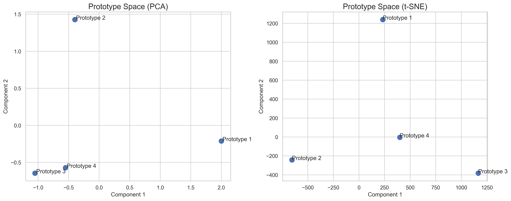

# Visualization Guide

This tutorial demonstrates how to use Verskyt's comprehensive visualization suite to understand and analyze Tversky Neural Networks (TNNs). The visualization tools help researchers explore learned prototypes, analyze similarity patterns, and debug model behavior.

## Prerequisites

Install Verskyt with visualization dependencies:
```bash
pip install verskyt[visualization]
```

This installs the optional dependencies: `matplotlib`, `seaborn`, and `scikit-learn`.

## Overview

Verskyt provides two main visualization functions:

- **`plot_prototype_space()`**: Visualizes learned prototypes using dimensionality reduction (PCA/t-SNE)
- **`visualize_prototypes_as_data()`**: Shows prototypes as interpretable data patterns

These tools are essential for understanding what your TNN models have learned and how they make decisions.

## Basic Prototype Visualization

Let's start with a simple example. First, create and train a basic TNN model:

```python
import torch
import torch.nn as nn
from verskyt import TverskyProjectionLayer
from verskyt.visualizations import plot_prototype_space

# Create a simple TNN model
class SimpleTNN(nn.Module):
    def __init__(self, input_dim=2, hidden_dim=8, output_dim=2, num_prototypes=4):
        super().__init__()
        self.encoder = nn.Sequential(
            nn.Linear(input_dim, hidden_dim),
            nn.ReLU(),
            nn.Linear(hidden_dim, hidden_dim)
        )
        self.tnn_layer = TverskyProjectionLayer(
            in_features=hidden_dim,
            num_prototypes=num_prototypes,
            num_features=16,
            alpha=1.0,
            beta=1.0
        )
        self.output_layer = nn.Linear(num_prototypes, output_dim)

    def forward(self, x):
        encoded = self.encoder(x)
        tnn_out = self.tnn_layer(encoded)
        return self.output_layer(tnn_out)

# Train on synthetic data (binary classification)
model = SimpleTNN()
# ... training code here ...
```

### Visualizing Learned Prototypes

Once your model is trained, extract and visualize the prototypes:

```python
# Extract learned prototypes
prototypes = model.tnn_layer.prototypes.data
prototype_labels = [f"Prototype {i+1}" for i in range(prototypes.shape[0])]

# Create prototype space visualization
plot_prototype_space(
    prototypes=prototypes,
    prototype_labels=prototype_labels,
    reduction_method='pca',
    title="Learned Prototype Space (PCA)"
)
```



The visualization shows how prototypes are distributed in the learned feature space after dimensionality reduction.

## Advanced Prototype-Feature Analysis

For deeper insights, you can visualize both prototypes and the feature bank:

```python
# Get feature bank (the learned similarity basis)
features = model.tnn_layer.feature_bank.data
feature_labels = [f"Feature_{chr(65+i)}" for i in range(features.shape[0])]

# Visualize prototype-feature relationships
plot_prototype_space(
    prototypes=prototypes,
    prototype_labels=prototype_labels,
    features=features,
    feature_labels=feature_labels,
    reduction_method="pca",
    title="Prototype-Feature Relationship Analysis"
)
```


This advanced visualization shows how prototypes relate to the learned feature basis, providing insights into the model's internal similarity computations.

## Data Clustering by Prototype Similarity

Understanding how real data points cluster around learned prototypes is crucial for model interpretation:

```python
import matplotlib.pyplot as plt

# Get similarity scores for all data points
model.eval()
with torch.no_grad():
    encoded_data = model.encoder(X_test)  # Your test data
    similarities = model.tnn_layer(encoded_data)
    most_similar_prototypes = torch.argmax(similarities, dim=1)

# Visualize data clustering
plt.figure(figsize=(10, 8))
colors = ['red', 'blue', 'green', 'orange']
for i in range(len(prototype_labels)):
    mask = most_similar_prototypes == i
    if mask.sum() > 0:
        plt.scatter(X_test[mask, 0], X_test[mask, 1],
                   c=colors[i], label=f'Most similar to {prototype_labels[i]}',
                   alpha=0.6, s=50)

plt.xlabel('Feature 1')
plt.ylabel('Feature 2')
plt.title('Data Points Colored by Most Similar Prototype')
plt.legend()
plt.grid(True, alpha=0.3)
plt.show()
```


This visualization reveals how the model partitions the input space based on prototype similarity.

## Case Study: XOR Problem

The XOR problem is a classic test of non-linear learning capability. Let's visualize how a TNN solves it:

```python
# Create XOR dataset
xor_inputs = torch.tensor([[0.0, 0.0], [0.0, 1.0], [1.0, 0.0], [1.0, 1.0]])
xor_targets = torch.tensor([0, 1, 1, 0]).float()

# Simple TNN for XOR
xor_model = TverskyProjectionLayer(
    in_features=2,
    num_prototypes=2,
    num_features=4,
    alpha=0.5,
    beta=0.5,
)

# Train the model (simplified training loop)
optimizer = torch.optim.Adam(xor_model.parameters(), lr=0.1)
for epoch in range(100):
    optimizer.zero_grad()
    outputs = xor_model(xor_inputs)
    predictions = torch.softmax(outputs, dim=1)[:, 1]
    loss = torch.nn.functional.binary_cross_entropy(predictions, xor_targets)
    loss.backward()
    optimizer.step()

# Visualize learned XOR prototypes
xor_prototypes = xor_model.prototypes.data
xor_labels = [f"XOR_Class_{i}" for i in range(xor_prototypes.shape[0])]

plot_prototype_space(
    prototypes=xor_prototypes,
    prototype_labels=xor_labels,
    title="XOR Problem: Learned Prototype Space"
)
```


This demonstrates how TNNs can solve non-linearly separable problems with interpretable prototype representations.

## Dimensionality Reduction Options

The visualization suite supports multiple dimensionality reduction methods:

### PCA (Principal Component Analysis)
- **Best for**: Understanding major variance directions
- **Preserves**: Global structure and linear relationships
- **Use when**: You want to see how prototypes spread across major axes of variation

```python
plot_prototype_space(prototypes, labels, reduction_method='pca')
```

### t-SNE (t-Distributed Stochastic Neighbor Embedding)
- **Best for**: Revealing local clustering patterns
- **Preserves**: Local neighborhood structure
- **Use when**: You want to see prototype groupings and clusters

```python
plot_prototype_space(prototypes, labels, reduction_method='tsne')
```

## Customization and Styling

The visualization functions support extensive customization:

```python
import matplotlib.pyplot as plt

# Create custom subplot layout
fig, ax = plt.subplots(1, 1, figsize=(12, 8))

# Customize the visualization
plot_prototype_space(
    prototypes=prototypes,
    prototype_labels=prototype_labels,
    reduction_method='pca',
    title="Custom Styled Prototype Analysis",
    ax=ax  # Use custom axes
)

# Add custom styling
ax.grid(True, alpha=0.3)
ax.set_xlabel("Principal Component 1", fontsize=12)
ax.set_ylabel("Principal Component 2", fontsize=12)
plt.tight_layout()
plt.show()
```

## Complete Example

For a comprehensive example that combines all these concepts, see [`examples/visualization_demo.py`](../../examples/visualization_demo.py). This script demonstrates:

1. **Model Training**: Complete TNN training pipeline
2. **Prototype Analysis**: PCA and t-SNE visualizations
3. **Data Clustering**: How data points relate to prototypes
4. **Feature Relationships**: Advanced prototype-feature analysis
5. **XOR Demonstration**: Classic non-linearity test case

Run the complete example:
```bash
cd examples
python visualization_demo.py
```

## Integration with Research Workflows

These visualization tools integrate seamlessly with Verskyt's research capabilities:

- **Intervention Studies**: Visualize prototype changes before/after interventions
- **Hyperparameter Analysis**: Compare prototype spaces across different α, β values
- **Architecture Studies**: Analyze how different TNN configurations affect learned representations
- **Similarity Method Comparison**: Visualize differences between intersection/difference reduction methods

## API Reference

For detailed API documentation, see:
- [`verskyt.visualizations.plot_prototype_space()`](../api/visualizations.md#plot_prototype_space)
- [`verskyt.visualizations.visualize_prototypes_as_data()`](../api/visualizations.md#visualize_prototypes_as_data)

## Next Steps

- Explore the [Research Tutorial](../../examples/research_tutorial.py) for advanced TNN concepts
- Check the [API Documentation](../api/index.md) for comprehensive reference
- See [Intervention Demo](../../examples/intervention_demo.py) for causal analysis techniques

---

*This tutorial is part of the Verskyt documentation. For more examples and guides, visit our [documentation site](https://verskyt.readthedocs.io).*
