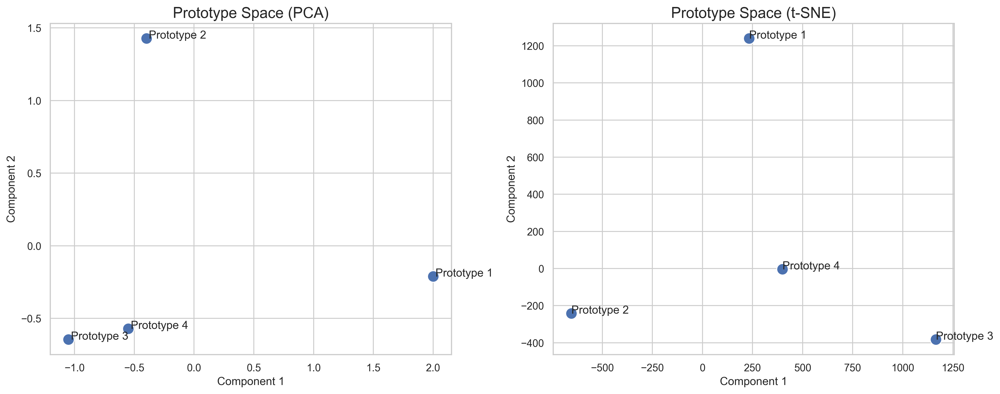
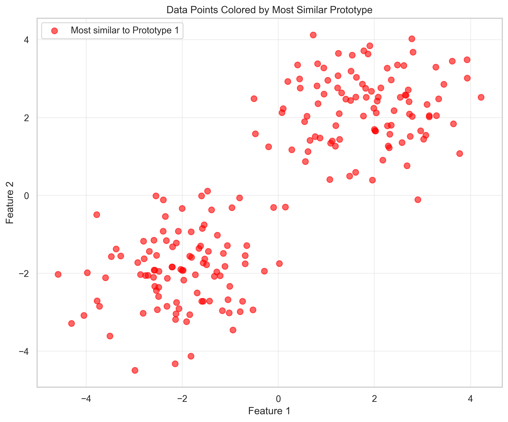
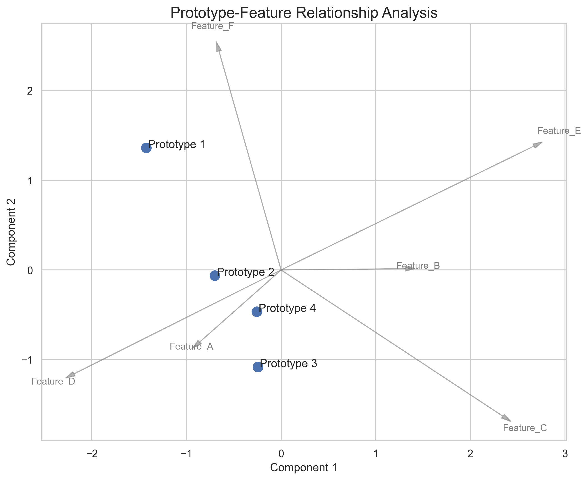
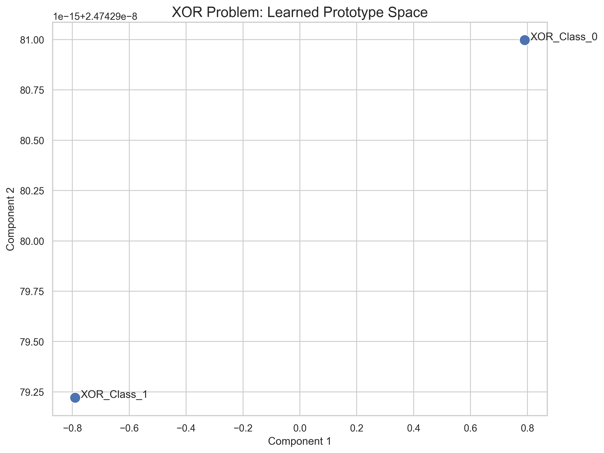

# Verskyt Examples

This directory contains practical examples demonstrating Verskyt's research-focused capabilities, including comprehensive visualization tools and research workflows.

## 🎨 Visualization Suite

**[visualization_demo.py](visualization_demo.py)** - Complete visualization showcase featuring:
- **Prototype Space Analysis**: PCA and t-SNE visualizations of learned prototypes
- **Data Clustering Visualization**: See how data points cluster by prototype similarity
- **Prototype-Feature Relationships**: Advanced analysis of prototype-feature interactions
- **XOR Problem Visualization**: Classic non-linearity demonstration

### Generated Visualizations

The visualization demo produces high-quality plots saved to `docs/images/examples/`:


*Prototype space visualized using PCA and t-SNE dimensionality reduction*


*Data points colored by their most similar prototype*


*Advanced prototype-feature relationship analysis*


*Learned prototype space for the XOR problem*

Run the visualization demo:
```bash
cd examples
python visualization_demo.py
```

**Requirements**: Install with visualization dependencies: `pip install verskyt[visualization]`

## 🔬 Research Tutorial

**[research_tutorial.py](research_tutorial.py)** - Comprehensive demonstration of:
- **Modularity**: Experimenting with 12 similarity variants
- **Introspection**: Analyzing learned prototypes, features, and parameters
- **Extensibility**: Intervention studies and custom similarity functions
- **Validation**: Research-grade benchmarking and reproducibility

Run the tutorial:
```bash
cd examples
python research_tutorial.py
```

## Quick Examples

### Basic Usage
```python
from verskyt import TverskyProjectionLayer
import torch

# Drop-in replacement for nn.Linear
layer = TverskyProjectionLayer(
    in_features=128,      # Dimensionality of the input vector
    num_prototypes=10,    # Output classes
    num_features=256      # Dimensionality of the internal learned feature space (Ω)
)
x = torch.randn(32, 128)
output = layer(x)  # [32, 10]
```

### Research Introspection
```python
# Access learned representations
prototypes = layer.prototypes.detach()  # What the model recognizes
features = layer.feature_bank.detach()  # Similarity basis
alpha, beta = layer.alpha.item(), layer.beta.item()  # Asymmetry

print(f"Model learned α={alpha:.3f}, β={beta:.3f}")
```

### Intervention Studies
```python
# Modify prototype and observe changes
original = layer.get_prototype(0)
layer.set_prototype(0, torch.zeros_like(original))

# Test modified behavior
modified_output = layer(x)
# Restore for further experiments
layer.set_prototype(0, original)
```

### Custom Similarity Experiments
```python
from verskyt.core import tversky_similarity

# Test different mathematical formulations
sim = tversky_similarity(
    x, prototypes, features,
    alpha=0.8, beta=0.2,  # Asymmetric
    intersection_reduction="max",
    difference_reduction="ignorematch"
)
```

## Coming Soon

- **Vision Tutorial**: ResNet with Tversky final layers
- **NLP Tutorial**: Attention mechanisms using similarity
- **Benchmark Reproduction**: Full paper result validation
- **Custom Architecture**: Building multi-layer Tversky networks

## Research Applications

Based on "Tversky Neural Networks" capabilities:
- **Few-shot Learning**: Prototype-based classification
- **Interpretable AI**: Human-recognizable learned features
- **Causal Analysis**: Intervention studies on representations
- **Architecture Search**: Systematic layer replacement studies
